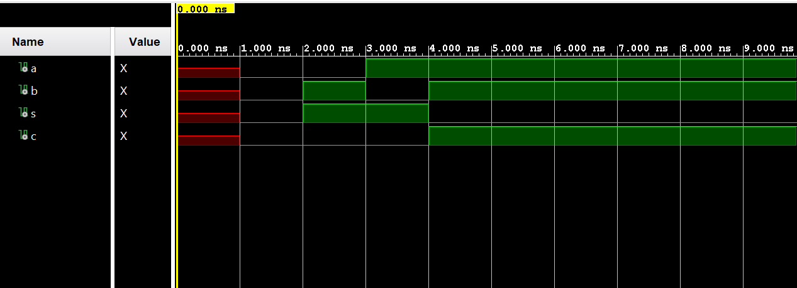
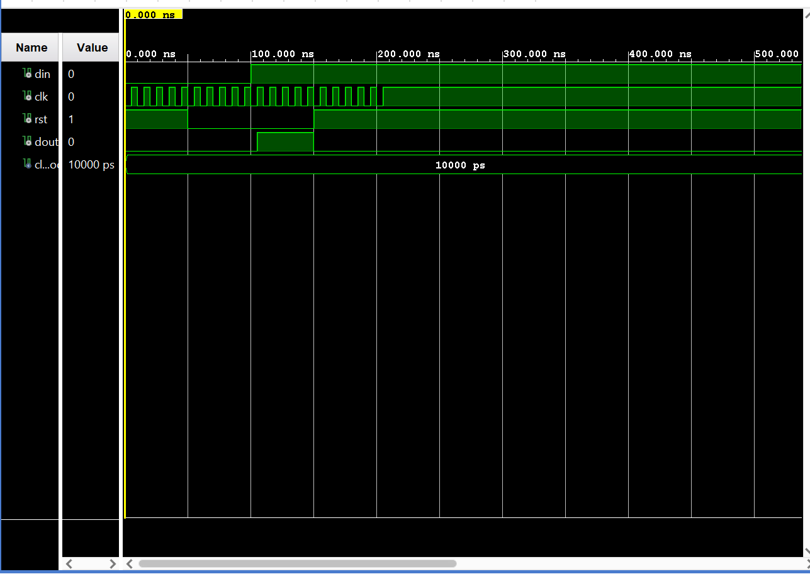

### James Flanagan
#### Lab 1 GHDL and GTKWave
---
Half Adder Example
---

This is a simulation of a half adder. Signals a and b are the inputs, s and c are the outputs. We can see that when only a or b is 1, s is 1 and c is 0. When a and b are both 0, s and c are also both 0. When a and b are both 1, then s is 0 and c is 1.

D Flip-Flop Example
---

This is a simulation of a D Flip-Flop. It has 3 input signals, din, clk and rst. It also has one output signal dout. On the rising edge of clk, dout is set to the din's current value. rst is asynchronous and will force dout to be 0 whenever rst is 1, otherwise when rst is set to 0 dout will remain 0 until the next rising edge of clk where it will then be updated to din's current value.

