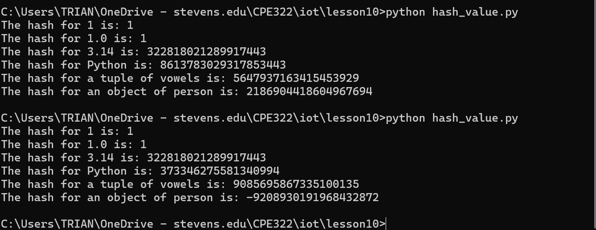
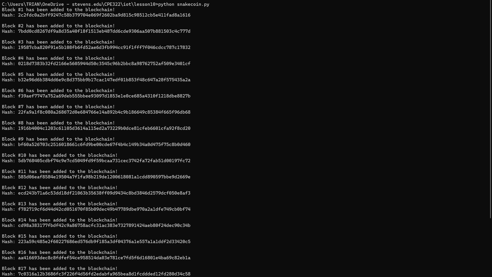
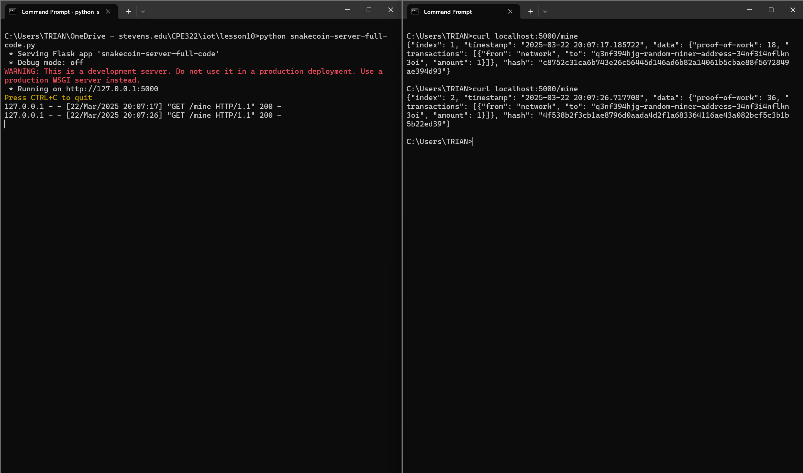
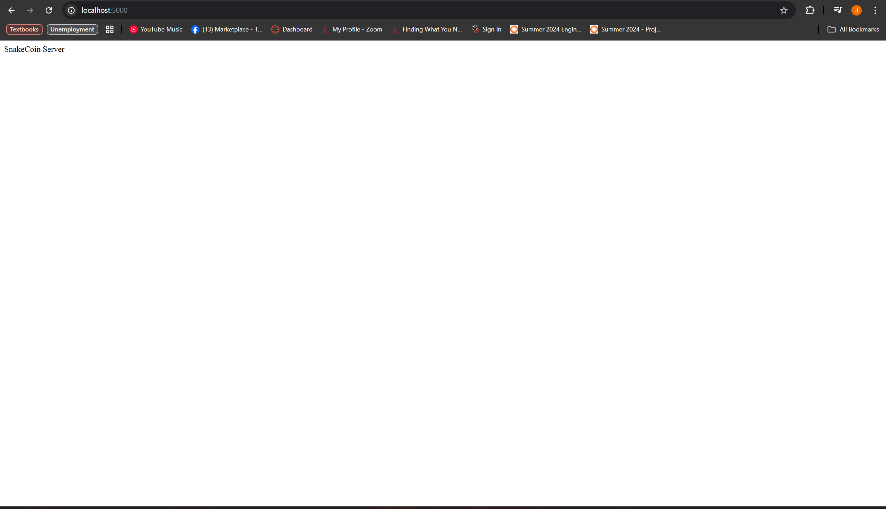

### James Flanagan
#### Lab 10 Blockchain
---
Hash function
---


I ran hash_value.py twice, the first 3, 1, 1.0, and 3.14 all returned the same hash value.
But for Python, Tuple of Vowels, and object of person had very different hash values. This is because the first for 1, 1.0, and 3.14 the hash function is being called on the value of those. Whereas for Python, tuple of voewls, and the object of person, the hash function is being called on the memory address of where those objects are stored which will be different each time the program runs.

---
Tiniest Blockchain
---



First I ran the snakecoin.py script which generated 20 blocks of the SnakeCoin blockchain.





Then I ran the SnakeCoin server in one terminal, and used a second terminal to mine each SnakeCoin.
Additionally I visited the webpage at localhost:5000

---
Python blockchain app
---


First I cloned the blockchain app repo to my working directory to get all of the necessary files.


After running
```
python run_app.py
```
in my terminal to start the blockchain server, I visited the website at localhost:5000
There I was able to enter content and my name. After which I clicked post and request to mine.
After clicking Resync my message appeared on the site.

