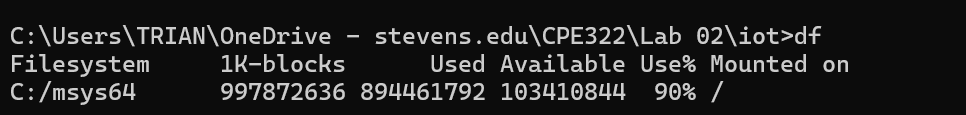

### James Flanagan
#### Lab 2 Command Line
---
Commands
---

hostname

env

ps

pwd

git clone

cd and ls

df

Directory and file manipulation with mkdir, nano, cat, cp, mv, and rm

uname

ipconfig

ping and netstat

