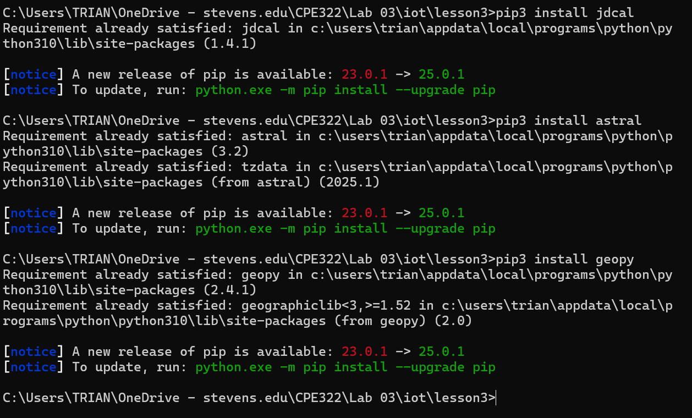
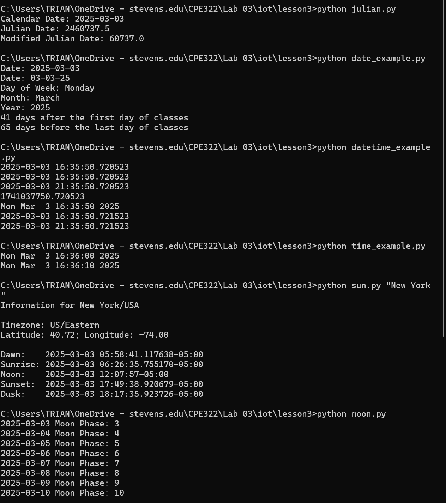
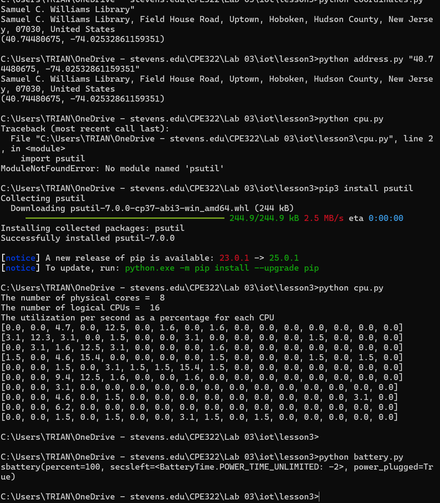
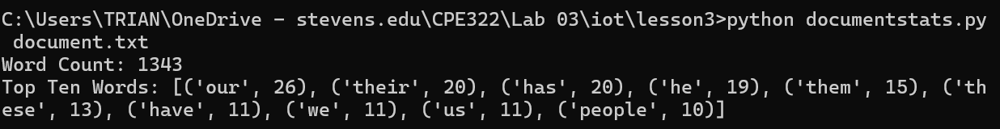

### James Flanagan
#### Lab 2 Python
---
Installations
---

I already had jdcal, astral, and geopy installed on my computer, so when I tried installing them I was informed that I already met the requirements for them

---
Programs
---

All of the programs ran successfully except for cpu.py, because I was migging the psutil module. After installing this modulue with pip3 cpu.py ran perfectly.

It was neat to see how much you can do with Python libraries. I had no idea that were were already made libraries that could get all of the moon phaseses or locate places from their gps coordinates.
