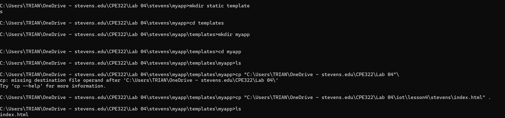
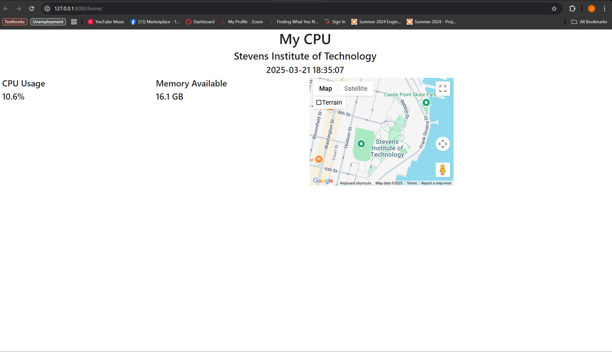

### James Flanagan
#### Lab 4 Django and Flask

Stevens Django project
---


I start a Django project and app here called stevens utilizing these instructions
```
django-admin startproject stevens
```
```
python manage.py startapp myapp
```


Here I am using nano to edit the settings.py file I am adding an asterick to ALLOWED_HOSTS and 'myapp' to INSTALLED_APPS

After this I copied urls.py into the ~/stevens/stevens directory, and also copied admin.py, models.py and views.py to ~/stevens/myapp



After creating a templates and additional myapp directory inside of ~/stevens/myapp, I copy index.html into ~/stevens/myapp/templates/myapp

I then utilized nano to modify index.html to enter my Google Maps API key

Then I copied all of the necessary static files to ~/stevens/myapp/static and ~/stevens/myapp/static/myapp

Finally I ran
```
python manage.py makemigrations myapp
python manage.py migrate
python manage.py createsuperuser
```
to finish the setup.

Next I ran the Django server with
```
python manage.py runserver
```
and was able to see the running webpage after inputting the temperature data


---
mycpu Django REST project
---


I start a Django project and app here called stevens utilizing these instructions
```
django-admin startproject mycpu
```
```
python manage.py startapp myapp
```


Here I am using nano to edit the settings.py file I am adding an asterick to ALLOWED_HOSTS and 'myapp' and 'rest_framework' to INSTALLED_APPS


Next I copy urls.py into the ~/mycpu/mycpu directory


I also copied admin.py, models.py, views.py and serializers.py to ~/mycpu/myapp


Here I create the necessary templates and myapp directory and index.html into ~/mycpu/myapp/templates/myapp

I then utilized nano to modify index.html to enter my Google Maps API key

Then I copied all of the necessary static files to ~/mycpu/myapp/static and ~/mycpu/myapp/static/myapp

I also copy controller.py to ~/mycpu


Next I ran
```
python manage.py makemigrations myapp
python manage.py migrate
python manage.py createsuperuser
```
to finish the setup.

I run the server with
```
python manage.py runserver
```

With the server running I input the location data and post
- 2024 to the Dt List at [http://127.0.0.1:8000/dt](http://127.0.0.1:8000/dt)
- 20 to the Cpu List at [http://127.0.0.1:8000/cpu](http://127.0.0.1:8000/cpu)
- 20 to the Mem List at [http://127.0.0.1:8000/mem](http://127.0.0.1:8000/mem)

Finally I run the native controller service in a seperate terminal window with
```
python controller.py
```



The final result, which displays my
- CPU usage
- Memory usage
- A map of Stevens
- The current date

---
Flask Hello World
---


I run 
```
python hello_world.py
```

which starts the flask server which displays this


