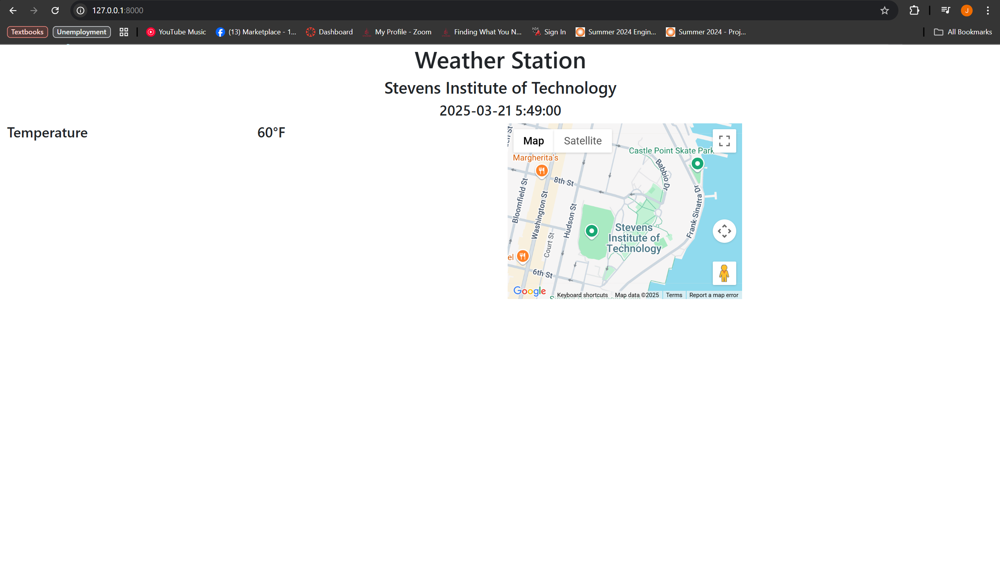
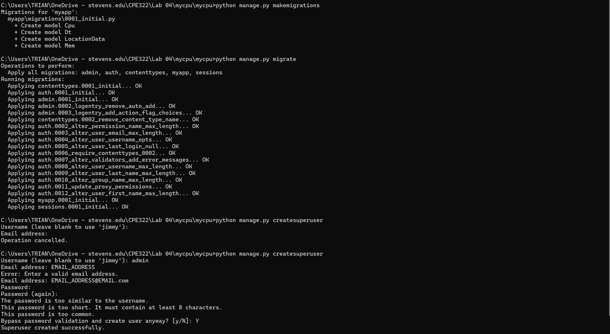
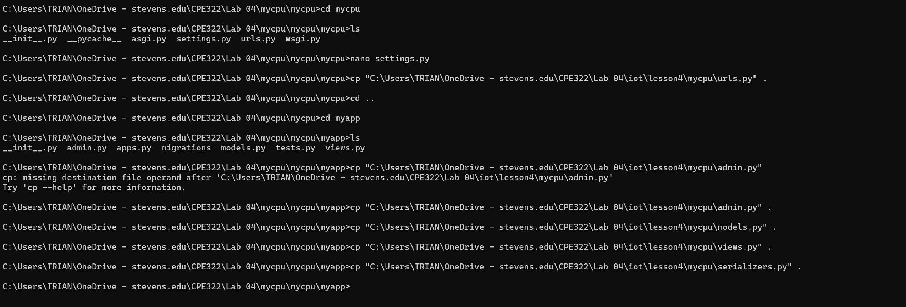
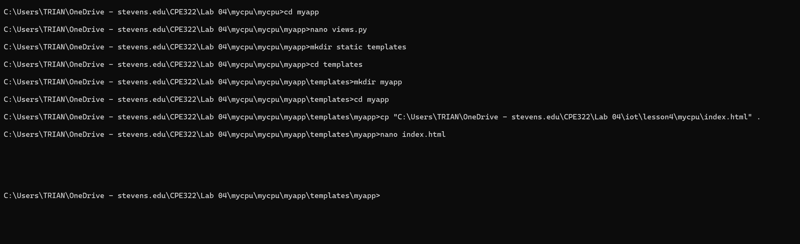
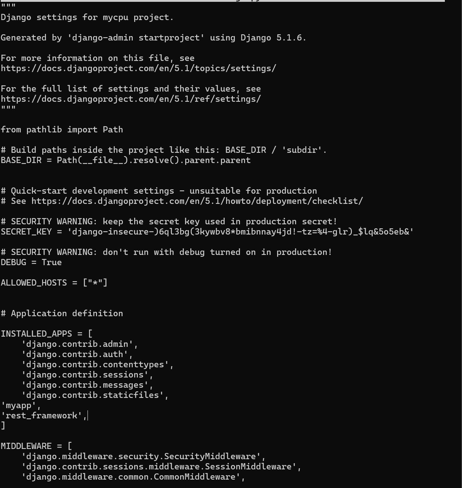
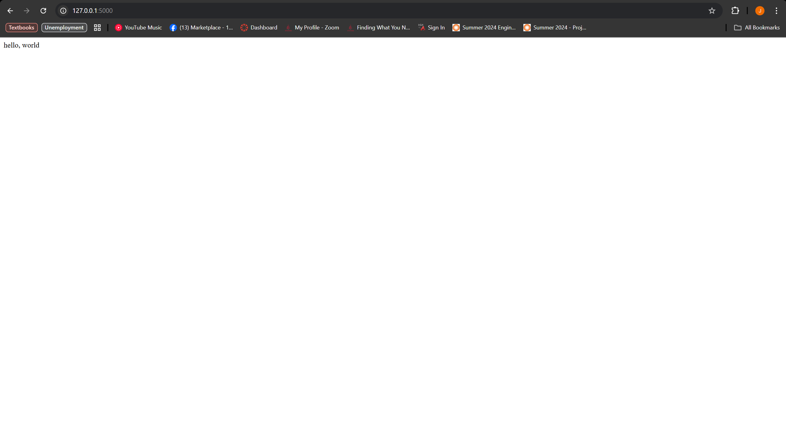

### James Flanagan
#### Lab 4 Django and Flask

Weather Sation
---


I start a Django project and app here called stevens utilizing these instructions
```
django-admin startproject stevens
```
```
python manage.py startapp myapp
```


Here I am using nano to edit the settings.py file I am adding an asterick to ALLOWED_HOSTS and 'myapp' to INSTALLED_APPS'

After this I copied urls.py into the ~/stevens/stevens directory, and also copied admin.py, models.py and views.py to ~/stevens/myapp


After creating a templates and additional myapp directory inside of ~/stevens/myapp, I copy index.html into ~/stevens/myapp/templates/myapp

I then utilized nano to modify index.html to enter my Google Maps API key

Then I copied all of the necessary static files to ~/stevens/myapp/static and ~/stevens/myapp/static/myapp

Finally I ran
```
python manage.py makemigrations myapp
python manage.py migrate
python manage.py createsuperuser
```
to finish the setup.

Next I ran the Django server with
```
python manage.py runserver
```
and was able to see the running webpage after inputting the temperature data



---
My Cpu
---







---
Flask Hello World
---


