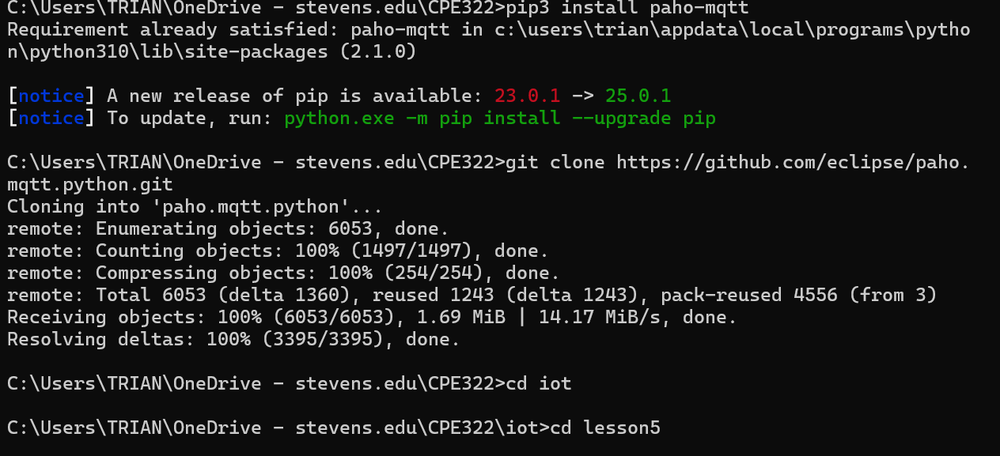
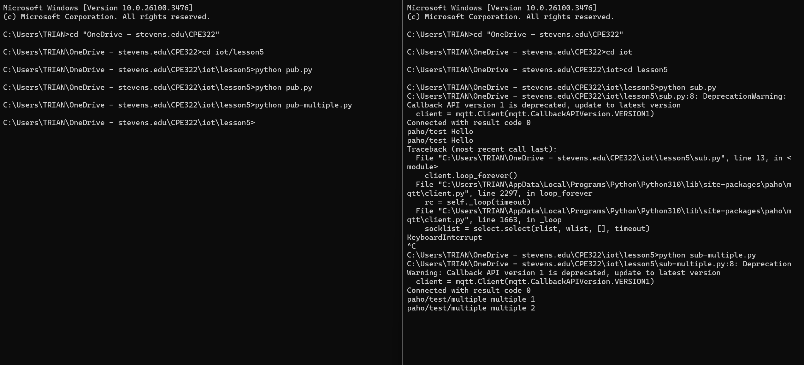
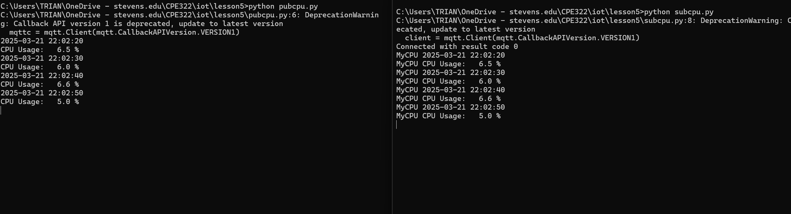

### James Flanagan
#### Lab 5 Paho-MQTT
---
Installation
---

I start by installing paho-mqtt using pip and pulling the latest Paho MQTT client repository from GitHub.
I then go to the iot folder and start client.py and open 2 new terminals

---
Running
---

The terminal on the right is running sub.py at first, which is a MQTT subscriber and is listening for new messages.
The terminal on the left runs pub.py, which is a MQTT publisher and sends messages which can be recieved by MQTT subscribers.
So whenever I run pub.py on the left terminal, the right terminal prints "paho/test hello"

After that I run sub-multiple.py and pub-multiple.py on the right and left terminals respectively. We see the exact same behavior as we did when running sub.py and pub.py except for the fact that there are now multiple messages sent and recieved at once.

Now, the terminal on the right is running subcpu.py and the one on the left is running pubcpu.py.

pubcpu.py periodically publishes my CPU usage which is then recieved by subcpu.py

