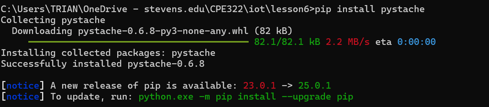
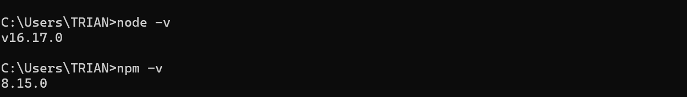
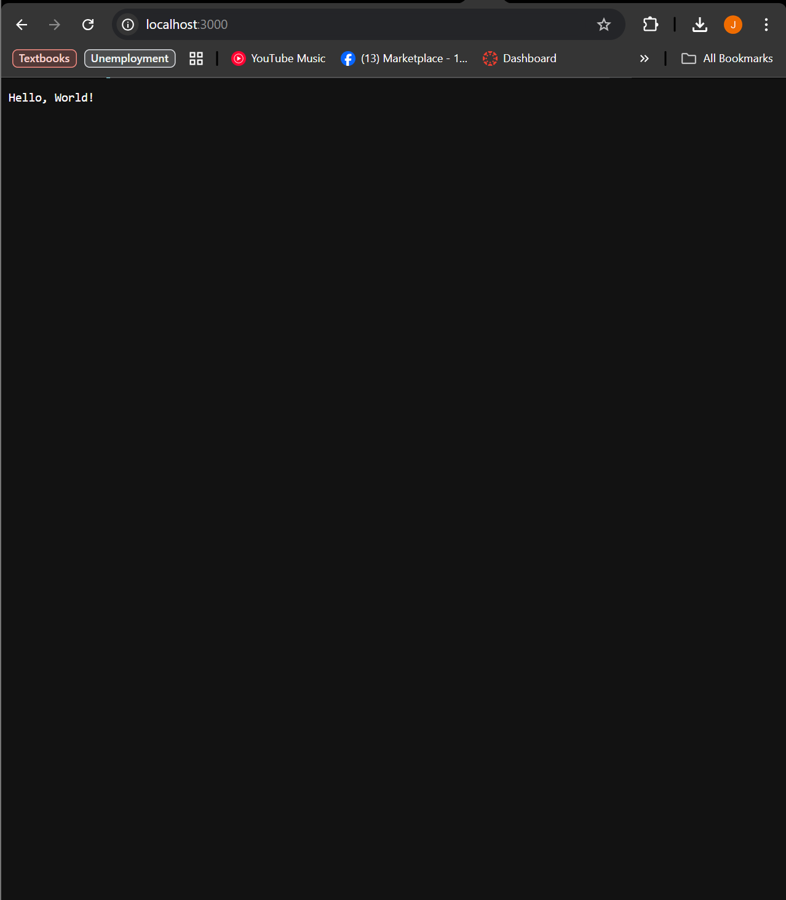
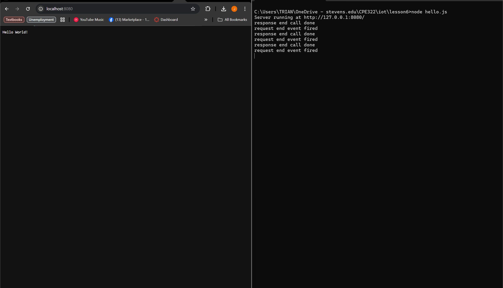
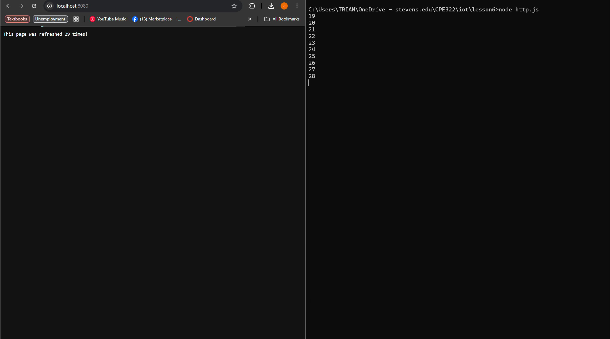
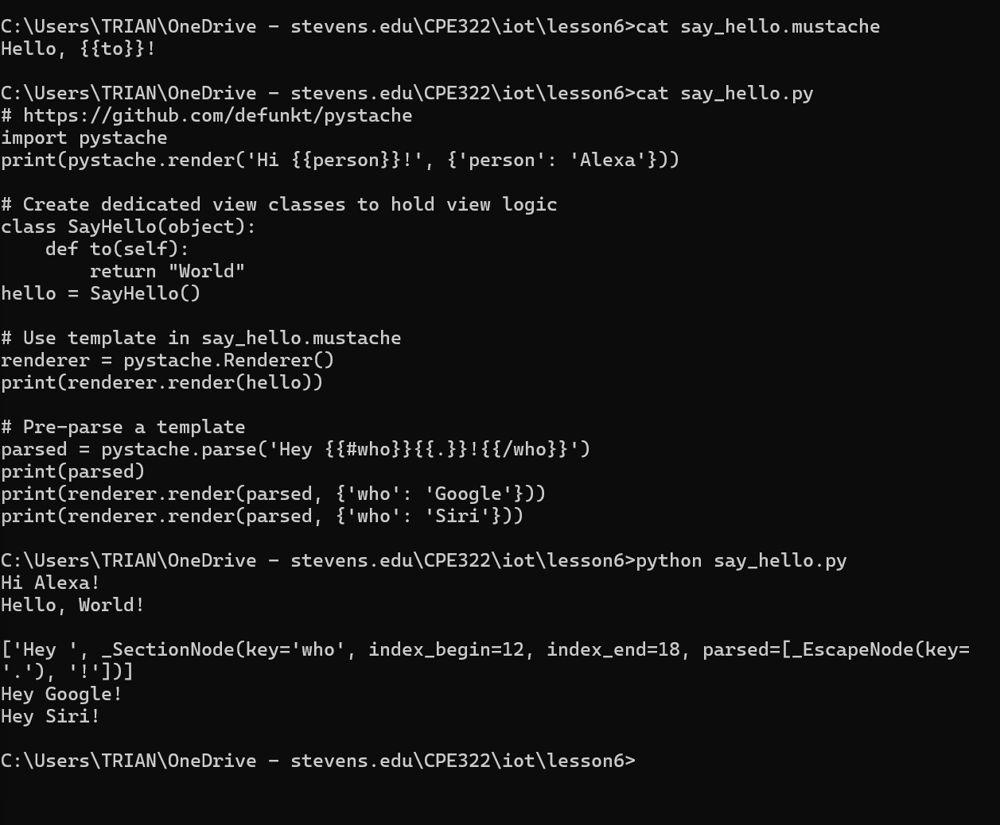

### James Flanagan
#### Lab 6 Node.js and Pystache
---
Installations
---
  
Pystache installation using pip
  
I already hade node and npm installed from previous projects, these are the versions I currently have

---
Node.js
---
  

  The first file I ran was hello-world.js, it runs a webpage that displays "Hello, World!" 
  
  

  The next file I ran was hello.js, it runs a webpage that displays "Hello World!"
  Whenever the page is opened or refreshed the terminal in which the pare is running on sends 
  
  "response end call done"
  
  "response end event fired"
  
  

  The last node.js file I ran, https.js, runs a webpage that displays "This page was refreshed X times!" where X is the number of times the page was refreshed. In the terminal, each time the page is refreshed the terminal outputs the number of times the page has been refreshed - 1
  
---
Pystache
---
  

  After installing pystache I ran the example code from Lesson 6
  ```
  cd ~/iot/lesson6
  cat say_hello.mustache
  cat say_hello.py
  python say_hello.py
  ```
  The results of this code can be seen above
  
