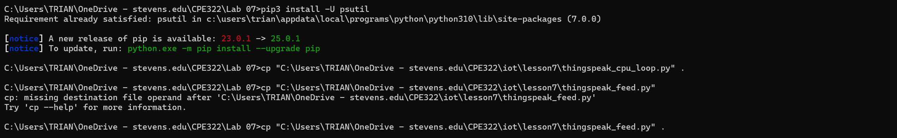
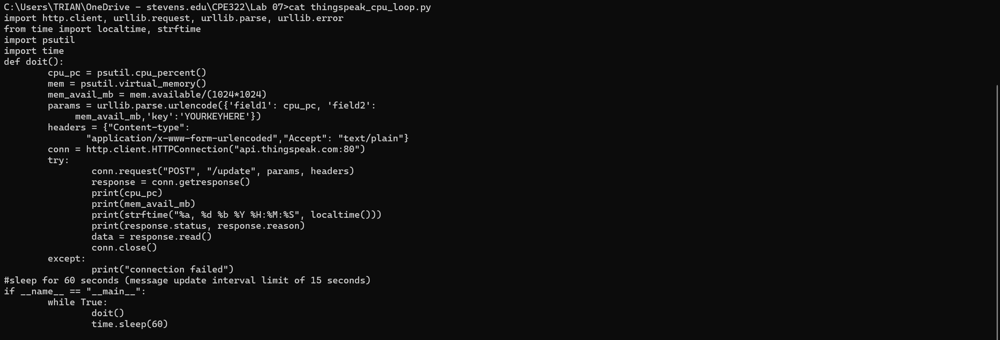
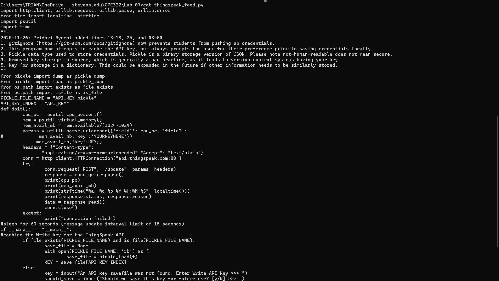
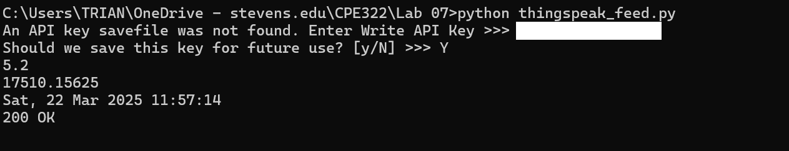
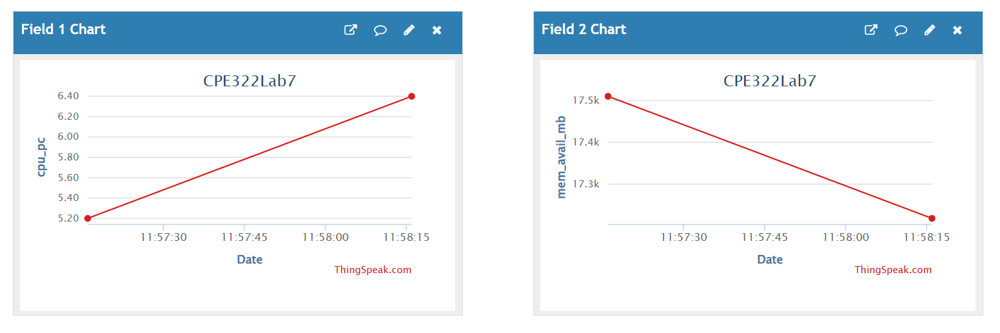
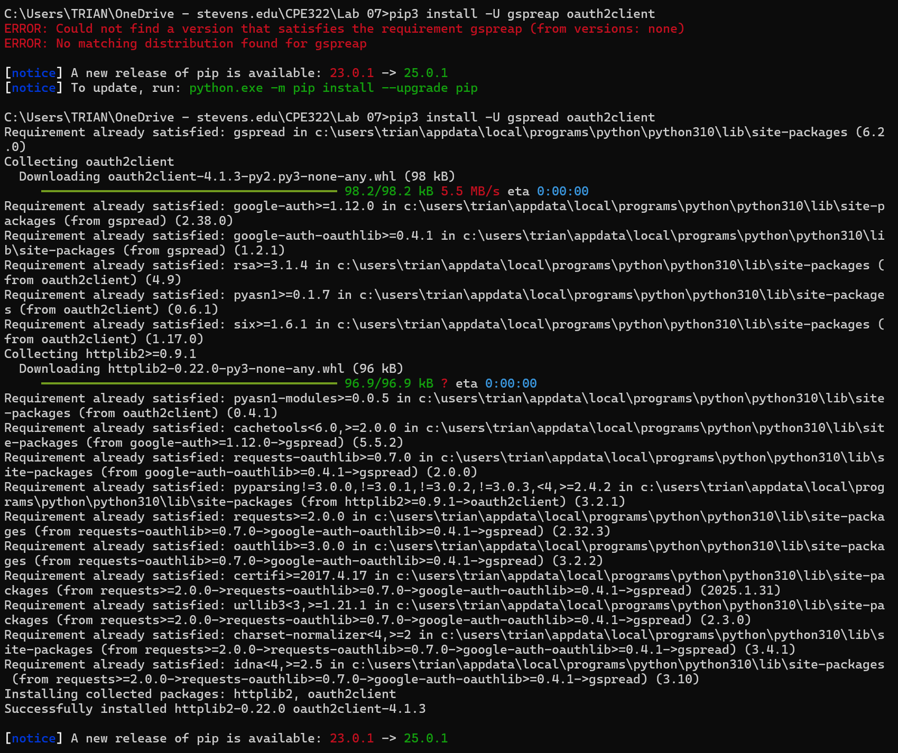
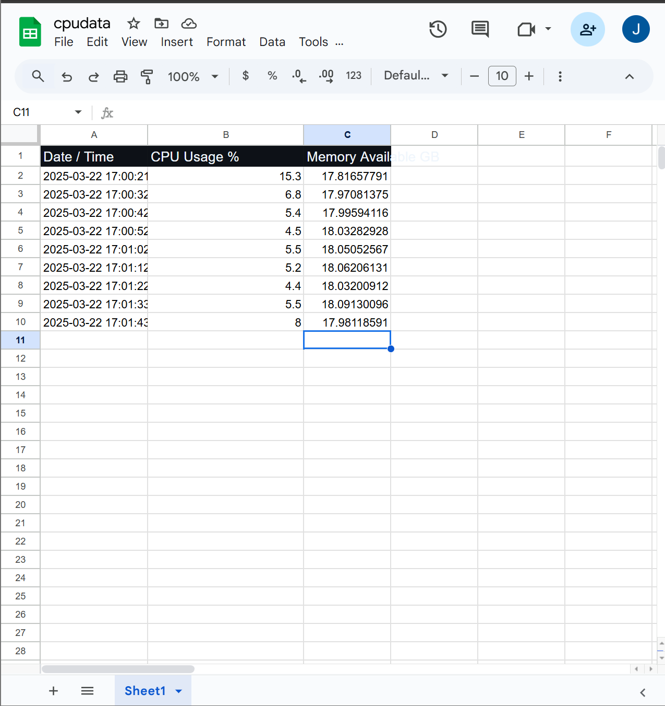

### James Flanagan
#### Lab 7 ThingSpeak and Google Sheets
---
ThingSpeak
---

After signing up for ThingSpeak and getting my Write API key I started doing the setup on my computer

First I made sure I had psutil installed, and copied thingspeak_cpu_loop.py and thingspeak_feed.py to my working directory

I utilized cat to view both of the python scripts 

Then after running thingspeak_feed.py I was prompted to enter my ThingSpeak API key, which I then entered.

After this I was able to visit the ThingSpeak website and view my CPU usage and available memory

---
Google Sheets
---

The first thing I did was setting up my Google Cloud Platform Identity and Access Management

I created an a project named cpudata and enableld the Drive API and Sheets API. From this point I then created a JSON key and downloaded it.

After getting my JSON key I downloaded the necessary python libraries using pip.
I also copied cpu_spreadsheet.py to my directory since I was running it on my comptuer and not a Raspberry Pi.

In google sheets I shared a new spreadsheet titled cpudata with the client_email address inside of my .json file.

Finally after using nano to put my json key inside cpu_spreadsheet.py I was ready to run the Python script.

When I ran the script, it would periodically update the sheet with my computers current CPU usage and available memory every 10 seconds.

