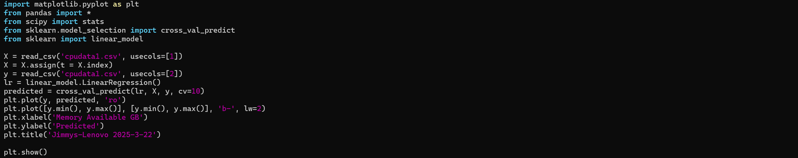

### James Flanagan
#### Lab 8 Data Analysis
---
Setup
---


First, I install all of the necessary libraries in a virtual enviorment in my WSL terminal using 
```
pip3 install numpy scipy scikit-learn matplotlib pandas tensorflow keras
```


Then I copy my cpudata.csv file from Lab 7 into my demo directory. This took afew additional steps since I was now working in WSL


I copied plt_final.py and plt_cv2.py to my demo directory




Finally, I used Vim to modify plt_final.py and plt_cv2.py with my csv filename, and changed temperature to Memory Available since I used cpu_spreadsheet.py in lab 7, which gave me Memory Available instead of the temperature

---
Results
---


The first 6 plots were displayed after running plt_final.py


The last plot was displayed after running plt_cv2.py


