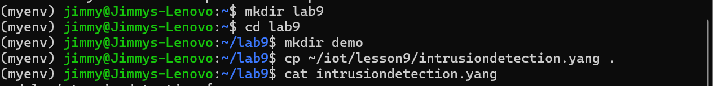
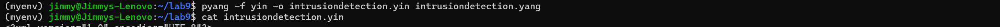
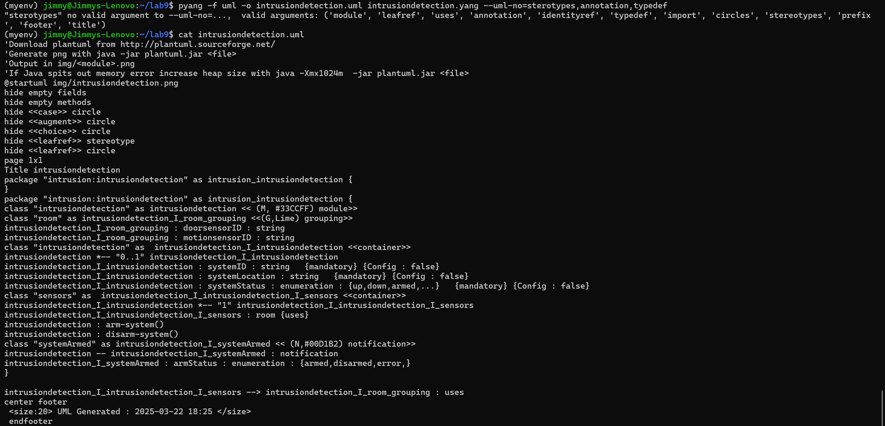
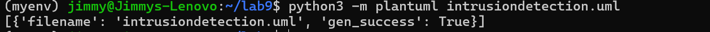
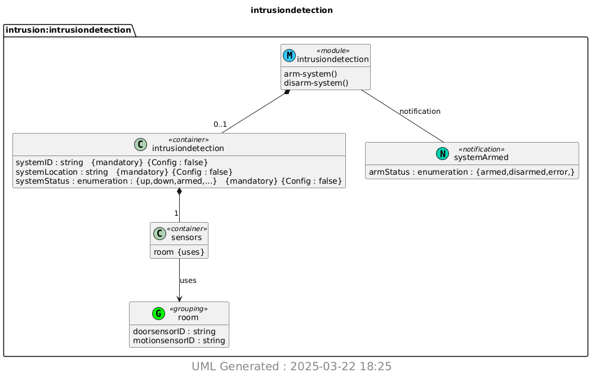

### James Flanagan
#### Lab 9 YANG
---
Setup
---
I start by doing
```
pip3 install pyang plantuml1
```
to install pyang and plantuml



Then I set up my project directory and copy intrusiondetection.yang into it

---
Results
---

First, I run 
```
pyang -f yin -o intrusiondetection.yin intrusiondetection.yang
```
to generate my .yin file



Next, I run 
```
pyang -f uml -o intrusiondetection.uml intrusiondetection.yang --uml-no=stereotypes,annotation,typedef
```
to generate my .uml file



Finally, I run
```
python3 -m plantuml intrusiondetection.uml
```
to generate the uml diagram shown below



