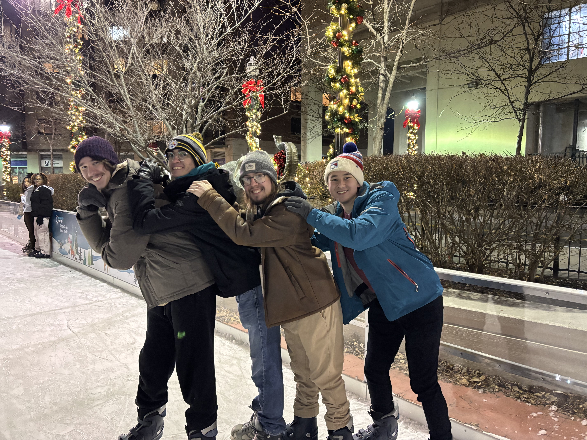

# CPE322 Repo
### James Flanagan
_Electrical Engineering Student at Stevens Instiute of Technology_

---

##### Team Project Website 

[https://begonia-prism-5lls.squarespace.com/](https://begonia-prism-5lls.squarespace.com/)

Password: Stevens


##### About Me

I am a 3/4 Electrical engineering major at Stevens Institute of Technology. With my degree I hope to have a career where I am able to work with **embedded systems** to create various devices.

##### Favorite Quote

> The mystery of life isn't a problem to solve, but a reality to experience. - Dune, Frank Herbert

<sub> The Dune series is my favorite book series. Im am currently reading book #3 right now, _Children of Dune_ </sub>


##### Favorite Website

[travle.earth](https://travle.earth/)

##### My Hobbies
- Reading
- Video Games
- Baseball
  - The Yankees
- NFL
  - The Pittsburg Steelers
  - LA Rams
- F1

##### My Friends!


---

##### Class Labs
1. [GHDL and GTKWave](https://github.com/Jflanag1stevens/CPE322/tree/main/Lab1)
2. [Command Line](https://github.com/Jflanag1stevens/CPE322/tree/main/Lab2)
3. [Python](https://github.com/Jflanag1stevens/CPE322/tree/main/Lab3)
4. [Django and Flask](https://github.com/Jflanag1stevens/CPE322/tree/main/Lab4)
5. [Paho-MQTT](https://github.com/Jflanag1stevens/CPE322/tree/main/Lab5)
6. [Node.js and Pystache](https://github.com/Jflanag1stevens/CPE322/tree/main/Lab6)
7. [ThingSpeak and Google Sheets](https://github.com/Jflanag1stevens/CPE322/tree/main/Lab7)
8. Data Analysis
9. YANG
10. Blockchain


##### Code

```
def gnot(x):
    assert x in [0,1]
    return int(not(x))
```
<sub> Code for a not gate in Python </sub>


